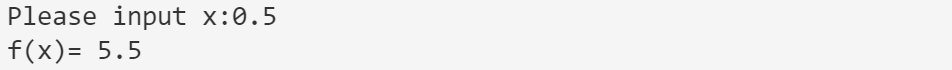
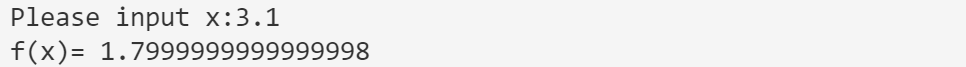
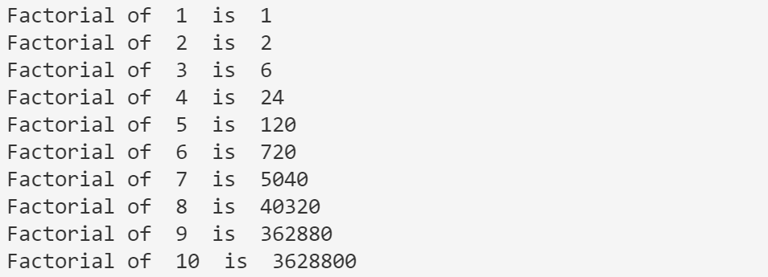
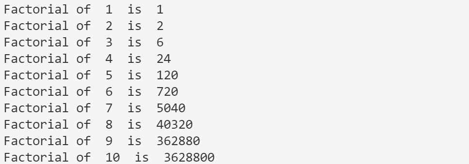
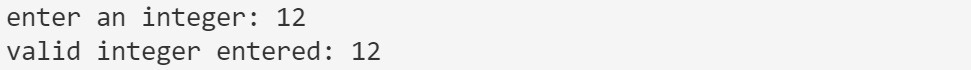
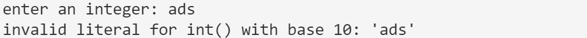

# Experiment 1

## 8.1

- Code

  ```python
  def cal(x):
      if (x <= 0):
          return 3 * x + 5
      elif (0 < x <= 1):
          return x + 5
      elif (x > 1):
          return -2 * x + 8
  
  
  try:
      x = input("Please input x:")
      print("f(x)=", cal(float(x)))
  except ValueError as err:
      print(err, "is not a number")
  
  ```

- Example

  - 

    此处原本想用`raise ValueError`语句，但后来发现这里转换不成功就会自动抛出错误。

  - 
  - 
  - 

## 8.2

- Code

  ```python
  def cal_factorial(x):
      factorial = 1
      tmp = 1
      while tmp <= int(x):
          factorial = factorial * tmp
          tmp = tmp + 1
      return factorial
  
  
  i = 1
  while i <= 10:
      print("Factorial of ", str(i), " is ", cal_factorial(i))
      i = i + 1
  
  ```

- Example
  - 

## 8.3

- Code

  ```python
  def cal_factorial(x):
      factorial = 1
      for i in range(1, x + 1):
          factorial = factorial * i
      return factorial
  
  
  for i in range(1, 11):
      print("Factorial of ", str(i), " is ", cal_factorial(i))
  
  ```

- Example
  - 

## 8.4

- Code

  ```python
  s = input("enter an integer: ")
  try:
      i = int(s)
      print("valid integer entered:", i)
  except ValueError as err:
      print(err)
  
  ```

- Example
  - 

  - 

    
