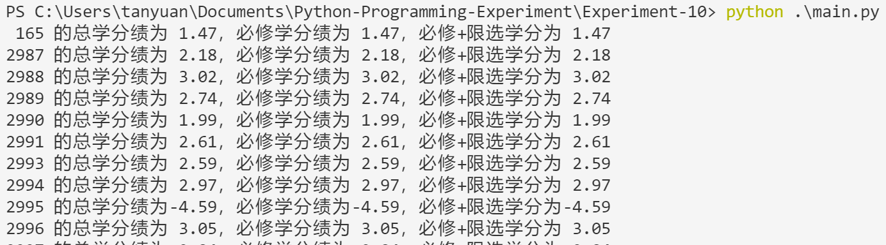
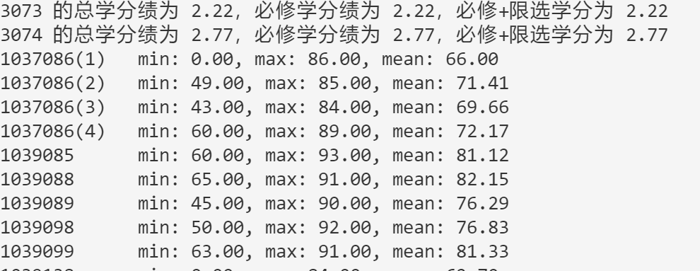
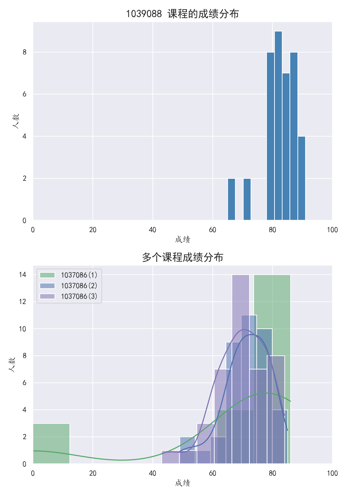

# Experiment 9

## 要求

使用第三方库xlrd、xlwt、xlutils、openpyxl、pandas、matplotlib、echarts等对附件成绩单情况进行分析汇总：计算各门课程的总分，该班级每门课程的平均分和最高分及最低分，并绘制相应的图形来统计各门课程的成绩分布，图形自选，标题，坐标轴标签，图例等属性设置完整。计算各同学的平均学分绩（分三种学分绩：总学分绩，必修学分绩，必修+限选学分绩），要求：有重修记录且最高分>=60分的课程成绩只能按60分计入；未通过的课程学分绩按0计入。学分绩为课程绩点与学分的成绩，绩点与成绩对应关系表如下：

| 成绩   | 60~69 | 70~79 | 80~89 | 90~100 |
| ------ | ----- | ----- | ----- | ------ |
| 学分绩 | 1~1.9 | 2~2.9 | 3~3.9 | 4~5    |

## 实现

实现了题目中的所有要求。

`read_excel` 函数从成绩单中读取数据，存入相应的数据结构中。因为存在着挂科重修的情况，而且挂科后绩点的计算方式和不挂科的绩点计算方式不同，需要对挂科的情况进行特殊处理。

对每个学生维护一个挂科课程的列表。因为考虑到重修后可能大于60分，那么如果有一行数据读到的成绩小于60，就把这门课程标记为挂科。一个学生可以多次修一个课程，那么就存这门课程最高的一次成绩。

```python
# 如果有一次该 course_id 的成绩低于60，标记为不及格课程
if int(score) < 60:
student[student_id]["failed_course"].append(course_id)

# 保留最高的一次成绩
if course_id in student[student_id]["score_list"]:
    if int(score) > int(student[student_id]["score_list"][course_id][0]):
		student[student_id]["score_list"][course_id][0] = score
else:
	student[student_id]["score_list"][course_id] = df.loc[i].values[3:6]
```

## 运行

### 各同学的平均学分绩：



因为成绩可能低于60分，题目中未定义60分以下的绩点如何计算。于是此处绩点为负数的表示成绩小于60分。

### 各门课程的总分，该班级每门课程的平均分和最高分及最低分



### 各门课程的成绩分布



## 代码

```python
import pandas as pd
from collections import defaultdict
from numpy import mean
import matplotlib.pyplot as plt
import matplotlib
import seaborn as sn


file_name = "成绩单.xlsx"


def read_excel(file_name):
    def def_value():
        return {
            "score_list": dict(),
            "total_GPA": None,
            "required_GPA": None,
            "required_and_optional_GPA": None,
            "failed_course": list(),
        }

    df = pd.read_excel(file_name)
    df.fillna(value="0", inplace=True)

    student = defaultdict(def_value)

    course = defaultdict(list)
    # print(df.loc[1].values[3:6])

    for i in range(len(df.index.values)):
        student_id = df.loc[i].values[0]
        course_id = df.loc[i].values[1]
        score = df.loc[i].values[3]

        if not score.isdigit():
            continue

        # 如果有一次该 course_id 的成绩低于60，标记为不及格课程
        if int(score) < 60:
            student[student_id]["failed_course"].append(course_id)

        # 保留最高的一次成绩
        if course_id in student[student_id]["score_list"]:
            if int(score) > int(student[student_id]["score_list"][course_id][0]):
                student[student_id]["score_list"][course_id][0] = score
        else:
            student[student_id]["score_list"][course_id] = df.loc[i].values[3:6]

        course[course_id].append(int(score))

    return student, course


def calculate_GPA(student, type):
    if type == "required_GPA":
        type_list = ["必修"]
    elif type == "required_and_optional_GPA":
        type_list = ["必修", "选修"]
    elif type == "total_GPA":
        type_list = ["必修", "选修", "公共"]

    sum = 0
    credits = 0
    for course_id in student["score_list"]:

        # 有重修记录且最高分>=60分的课程成绩只能按60分计入；未通过的课程学分绩按0计入
        if student["score_list"][course_id][2] in type_list:
            score = int(student["score_list"][course_id][0])
            if course_id in student["failed_course"]:
                if score < 60:
                    score = 0
                else:
                    score = 60

            sum += score * float(student["score_list"][course_id][1])
            credits += float(student["score_list"][course_id][1])

    average = sum / credits
    GPA = (average - 50) / 10

    student[type] = GPA


def print_student(students):
    for student in students:
        print(
            "{:4} 的总学分绩为{:5.2f}，必修学分绩为{:5.2f}，必修+限选学分为{:5.2f}".format(
                student,
                students[student]["total_GPA"],
                students[student]["required_GPA"],
                students[student]["required_and_optional_GPA"],
            )
        )


def print_course(course):

    for key, value in course.items():
        print(
            "{:12} min: {:.2f}, max: {:.2f}, mean: {:.2f}".format(
                key, min(value), max(value), mean(value)
            )
        )

    course_id = "1039088"

    sn.set(style="darkgrid")
    fig = plt.figure(figsize=(7, 10))  # 宽 高
    matplotlib.rcParams["font.sans-serif"] = ["KaiTi"]

    # axes 1
    ax1 = fig.add_subplot(2, 1, 1)
    fre_tuple = plt.hist(course[course_id], bins=10, color="steelblue")
    plt.title("{} 课程的成绩分布".format(course_id), fontproperties="SimHei", fontsize=15)
    plt.xlabel("成绩")
    plt.xlim((0, 100))
    plt.ylabel("人数")

    # axes 2
    ax2 = fig.add_subplot(2, 1, 2)

    count = 0
    color = ("g", "b", "m")
    for key, value in course.items():
        sn.histplot(value, kde=True, label=key, color=color[count])
        count = count + 1
        if count == 3:
            break
    plt.title("多个课程成绩分布".format(course_id), fontproperties="SimHei", fontsize=15)
    plt.xlim((0, 100))
    plt.xlabel("成绩")
    plt.ylabel("人数")
    plt.legend()
    plt.tight_layout()
    plt.show()


student, course = read_excel(file_name)

for stu in student:
    calculate_GPA(student[stu], "required_GPA")
    calculate_GPA(student[stu], "required_and_optional_GPA")
    calculate_GPA(student[stu], "total_GPA")


print_student(student)
print_course(course)
```

