# Experiment 2

## 1

- Code

  较源程序，对`digit[row]`使用`.replace('*',digits[column])`方法

  ```python
  import sys
  
  Zero = ["  ***  ", " *   * ", "*     *", "*     *", "*     *",
          " *   * ", "  ***  "]
  One = [" * ", "** ", " * ", " * ", " * ", " * ", "***"]
  Two = [" *** ", "*   *", "*  * ", "  *  ", " *   ", "*    ", "*****"]
  Three = [" *** ", "*   *", "    *", "  ** ", "    *", "*   *", " *** "]
  Four = ["   *  ", "  **  ", " * *  ", "*  *  ", "******", "   *  ",
          "   *  "]
  Five = ["*****", "*    ", "*    ", " *** ", "    *", "*   *", " *** "]
  Six = [" *** ", "*    ", "*    ", "**** ", "*   *", "*   *", " *** "]
  Seven = ["*****", "    *", "   * ", "  *  ", " *   ", "*    ", "*    "]
  Eight = [" *** ", "*   *", "*   *", " *** ", "*   *", "*   *", " *** "]
  Nine = [" ****", "*   *", "*   *", " ****", "    *", "    *", "    *"]
  
  Digits = [Zero, One, Two, Three, Four, Five, Six, Seven, Eight, Nine]
  
  try:
      digits = sys.argv[1]
      row = 0
      while row < 7:
          line = ""
          column = 0
          while column < len(digits):
              number = int(digits[column])
              digit = Digits[number]
              line += digit[row].replace('*',digits[column]) + " "
              column += 1
          print(line)
          row += 1
  except IndexError:
      print("usage: bigdigits.py <number>")
  except ValueError as err:
      print(err, "in", digits)
  
  ```

- Example

  - 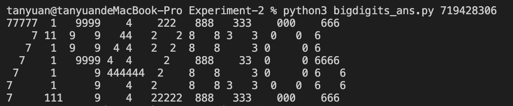


## 2

- Code

  ```python
  list = []
  
  while(True):
      try:
          x = input("enter a number or Enter to finish:")
          if x == '':
              break
          elif x.isdigit():
              list.append(int(x))
          else:
              raise TypeError(x)
  
      except TypeError as err:
          print(err, "is not a number or Enter")
          break
  
  
  sum = 0
  lowest = 9
  highest = 0
  
  for item in list:
      sum += item
      if item < lowest:
          lowest = item
      if item > highest:
          highest = item
  
  print('numbers:', list)
  print('count:', len(list), end=" ")
  print('sum:', sum, end=" ")
  print('lowest:', lowest, end=" ")
  print('highest:', highest, end=" ")
  print('mean:', sum/len(list))
  ```

- Example
  
  - 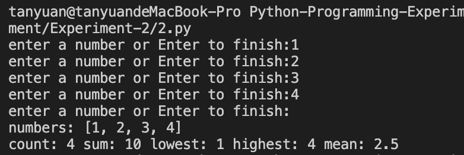

## 3

- Code

  ```python
  list = []
  
  while(True):
      try:
          x = input("enter a number or Enter to finish:")
          if x == '':
              break
          elif x.isdigit():
              list.append(int(x))
          else:
              raise TypeError(x)
  
      except TypeError as err:
          print(err, "is not a number or Enter")
          break
  
  
  try:
      if len(list) == 0:
          raise Exception()
  
      sum = 0
      lowest = 9
      highest = 0
  
      for item in list:
          sum += item
          if item < lowest:
              lowest = item
          if item > highest:
              highest = item
  
      if len(list) % 2 == 0:
          median = (list[int(len(list) / 2) - 1] + list[int(len(list) / 2)]) / 2
      else:
          median = list[int((len(list) - 1)/2)]
  
      print('numbers:', list)
      print('count:', len(list), end=" ")
      print('sum:', sum, end=" ")
      print('lowest:', lowest, end=" ")
      print('highest:', highest, end=" ")
      print('mean:', sum/len(list))
  
      print('median:', median)
  
  except Exception:
      print("no number in list")
  
  ```

- Example
  - 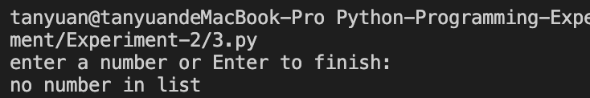
  - 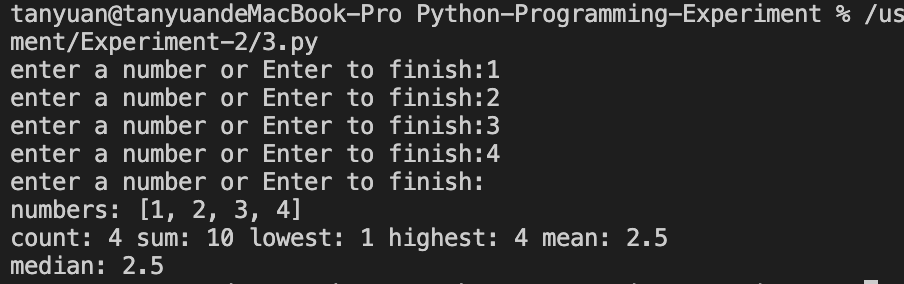
  - 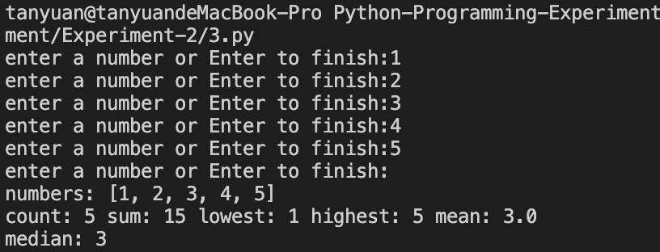

## 4

- Code

  ```python
  import random
  article = ("the", "a")
  subject = ("cat", "dog", "man", "woman")
  verb = ("sang", "ran", "jump")
  adverb = ("loud", "quiet", "well", "bad")
  
  
  def fun():
      print(random.choice(article), random.choice(
          subject), random.choice(verb), end=' ')
      if random.randint(0, 1) == True:
          print(random.choice(adverb), end='')
      print()
  
  
  for i in range(1, 6):
      fun()
  
  ```

- Example
  - 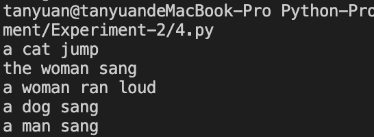

## 5

- Code

  ```python
  import random
  article = ("the", "a")
  subject = ("cat", "dog", "man", "woman")
  verb = ("sang", "ran", "jump")
  adverb = ("loud", "quiet", "well", "bad")
  
  
  def fun():
      print(random.choice(article), random.choice(
          subject), random.choice(verb), end=' ')
      if random.randint(0, 1) == True:
          print(random.choice(adverb), end='')
      print()
  
  
  try:
      x = int(input("enter a number:"))
      if x == '':
          tmp = 5
      elif 1 <= x <= 10:
          tmp = x
      else:
          raise ValueError(x)
      for i in range(1, tmp + 1):
          fun()
  
  except ValueError as err:
      print(err, "is not a vaild parameter")
  
  ```

- Example

  - 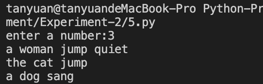
  - 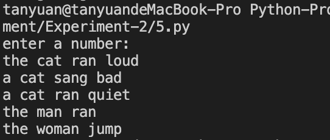
  - 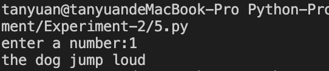
  - 
  - 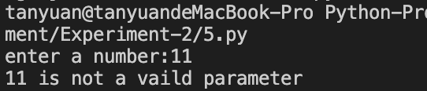
  - 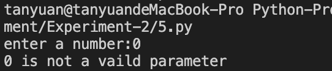
  - 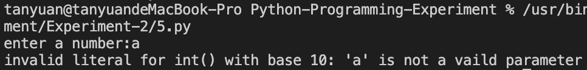

