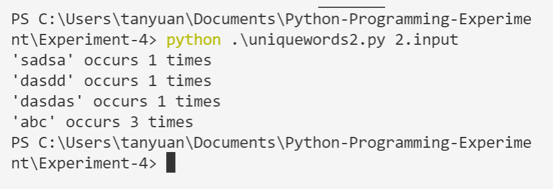
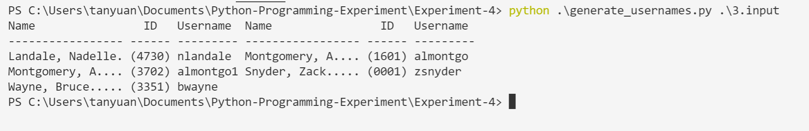

# Experiment 4

## 1. 修改 external_sites.py 程序

```python
import sys
import collections
from typing import DefaultDict

sites = DefaultDict(set)
for filename in sys.argv[1:]:
    for line in open(filename):
        i = 0
        while True:
            site = None
            i = line.find("http://", i)
            if i > -1:
                i += len("http://")
                for j in range(i, len(line)):
                    if not (line[j].isalnum() or line[j] in ".-"):
                        site = line[i:j].lower()
                        break
                if site and "." in site:
                    # sites.setdefault(site, set()).add(filename)
                    sites[site].add(filename)

                i = j
            else:
                break

for site in sorted(sites):
    print("{0} is referred to in:".format(site))
    for filename in sorted(sites[site], key=str.lower):
        print("    {0}".format(filename))

```

## 2.

- Code

  ```python
  import collections
  import sys
  
  
  ID, FORENAME, MIDDLENAME, SURNAME, DEPARTMENT = range(5)
  
  User = collections.namedtuple("User", "username forename middlename surname id")
  
  
  def main():
      if len(sys.argv) == 1 or sys.argv[1] in {"-h", "--help"}:
          print("usage: {0} file1 [file2 [... fileN]]".format(sys.argv[0]))
          sys.exit()
  
      usernames = set()
      users = {}
      for filename in sys.argv[1:]:
          for line in open(filename, encoding="utf8"):
              line = line.rstrip()
              if line:
                  user = process_line(line, usernames)
                  users[(user.surname.lower(), user.forename.lower(), user.id)] = user
      print_users(users)
  
  
  def process_line(line, usernames):
      fields = line.split(":")
      username = generate_username(fields, usernames)
      user = User(
          username, fields[FORENAME], fields[MIDDLENAME], fields[SURNAME], fields[ID]
      )
      return user
  
  
  def generate_username(fields, usernames):
      username = (
          (fields[FORENAME][0] + fields[MIDDLENAME][:1] + fields[SURNAME])
          .replace("-", "")
          .replace("'", "")
      )
      username = original_name = username[:8].lower()
      count = 1
      while username in usernames:
          username = "{0}{1}".format(original_name, count)
          count += 1
      usernames.add(username)
      return username
  
  
  def print_users(users):
      namewidth = 17
      usernamewidth = 9
  
      print(
          "{0:<{nw}} {1:^6} {2:{uw}}".format(
              "Name", "ID", "Username", nw=namewidth, uw=usernamewidth
          ),
          end=" ",
      )
      print(
          "{0:<{nw}} {1:^6} {2:{uw}}".format(
              "Name", "ID", "Username", nw=namewidth, uw=usernamewidth
          )
      )
      print(
          "{0:-<{nw}} {0:-<6} {0:-<{uw}}".format("", nw=namewidth, uw=usernamewidth),
          end=" ",
      )
      print("{0:-<{nw}} {0:-<6} {0:-<{uw}}".format("", nw=namewidth, uw=usernamewidth))
  
      flag = 0
      for key in sorted(users):
          user = users[key]
          initial = ""
          if user.middlename:
              initial = " " + user.middlename[0]
          name = "{0.surname}, {0.forename}{1}".format(user, initial)
          if len(name) > 17:
              name = name[:13]
          print(
              "{0:.<{nw}} ({1.id:4}) {1.username:{uw}}".format(
                  name, user, nw=namewidth, uw=usernamewidth
              ),
              end=" ",
          )
          flag = flag + 1
          if flag % 2 == 0:
              print()
  
  
  main()
  
  ```

- Example



## 3.

- Code

  ```python
  import collections
  import sys
  
  
  ID, FORENAME, MIDDLENAME, SURNAME, DEPARTMENT = range(5)
  
  User = collections.namedtuple("User", "username forename middlename surname id")
  
  
  def main():
      if len(sys.argv) == 1 or sys.argv[1] in {"-h", "--help"}:
          print("usage: {0} file1 [file2 [... fileN]]".format(sys.argv[0]))
          sys.exit()
  
      usernames = set()
      users = {}
      for filename in sys.argv[1:]:
          for line in open(filename, encoding="utf8"):
              line = line.rstrip()
              if line:
                  user = process_line(line, usernames)
                  users[(user.surname.lower(), user.forename.lower(), user.id)] = user
      print_users(users)
  
  
  def process_line(line, usernames):
      fields = line.split(":")
      username = generate_username(fields, usernames)
      user = User(
          username, fields[FORENAME], fields[MIDDLENAME], fields[SURNAME], fields[ID]
      )
      return user
  
  
  def generate_username(fields, usernames):
      username = (
          (fields[FORENAME][0] + fields[MIDDLENAME][:1] + fields[SURNAME])
          .replace("-", "")
          .replace("'", "")
      )
      username = original_name = username[:8].lower()
      count = 1
      while username in usernames:
          username = "{0}{1}".format(original_name, count)
          count += 1
      usernames.add(username)
      return username
  
  
  def print_users(users):
      namewidth = 17
      usernamewidth = 9
  
      print(
          "{0:<{nw}} {1:^6} {2:{uw}}".format(
              "Name", "ID", "Username", nw=namewidth, uw=usernamewidth
          ),
          end=" ",
      )
      print(
          "{0:<{nw}} {1:^6} {2:{uw}}".format(
              "Name", "ID", "Username", nw=namewidth, uw=usernamewidth
          )
      )
      print(
          "{0:-<{nw}} {0:-<6} {0:-<{uw}}".format("", nw=namewidth, uw=usernamewidth),
          end=" ",
      )
      print("{0:-<{nw}} {0:-<6} {0:-<{uw}}".format("", nw=namewidth, uw=usernamewidth))
  
      flag = 0
      for key in sorted(users):
          user = users[key]
          initial = ""
          if user.middlename:
              initial = " " + user.middlename[0]
          name = "{0.surname}, {0.forename}{1}".format(user, initial)
          if len(name) > 17:
              name = name[:13]
          print(
              "{0:.<{nw}} ({1.id:4}) {1.username:{uw}}".format(
                  name, user, nw=namewidth, uw=usernamewidth
              ),
              end=" ",
          )
          flag = flag + 1
          if flag % 2 == 0:
              print()
  
  
  main()
  
  ```

- Example

