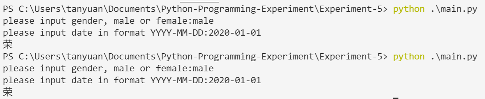
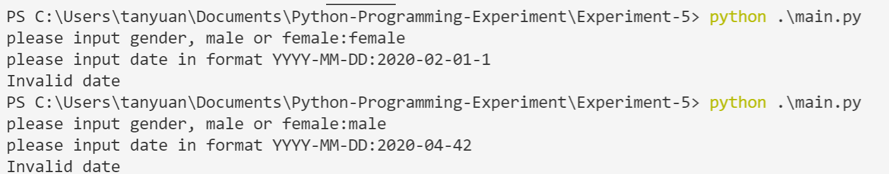
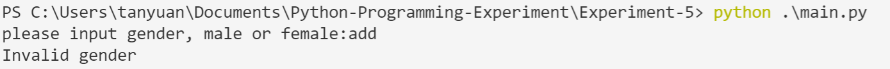
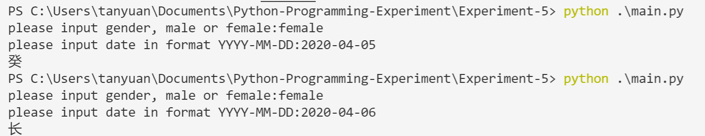
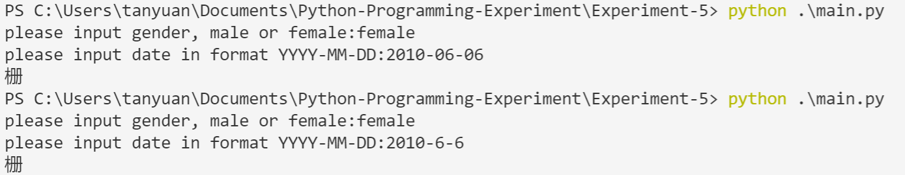

# Experiment 5

## 要求
完成一个“科学算命”的课题，即“科学起名”，用户可输入出生年月日时，性别，程序随机给出二字的名字，要求输入内容相同时候输出相同，输入内容不同时候输出不同。

## 思路

一开始想使用类似哈希表的方式，进行冲突处理。但后来觉得不是很有必要。

然后想使用随机数生成的方式，把日期作为随机数种。这样相同的日期可以得到同样的index。但这样的方式生成的index可以冲突。

后来又觉得干脆直接把日期拼成一个纯数字的字符串然后根据字库的大小求模好了，这样当然还是可能会产生冲突，但如果字库够大，冲突的概率就越小。使用此思路实现。

```python
database[index % len(database)]
```

## 输入示例

- 
- 
- 
- 
- 

