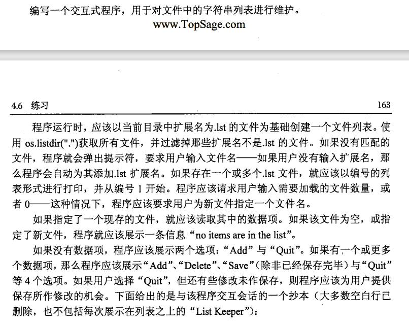
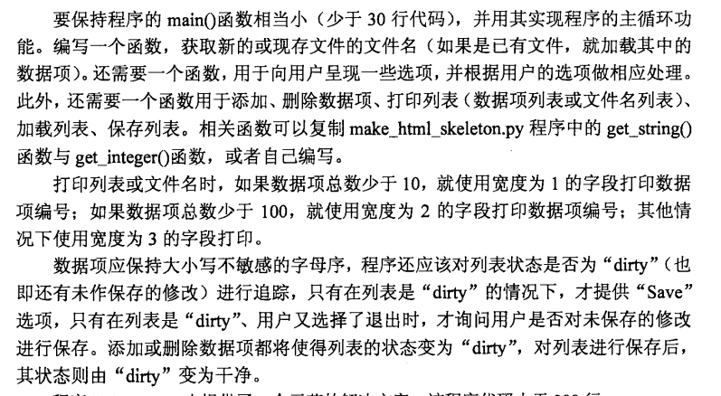
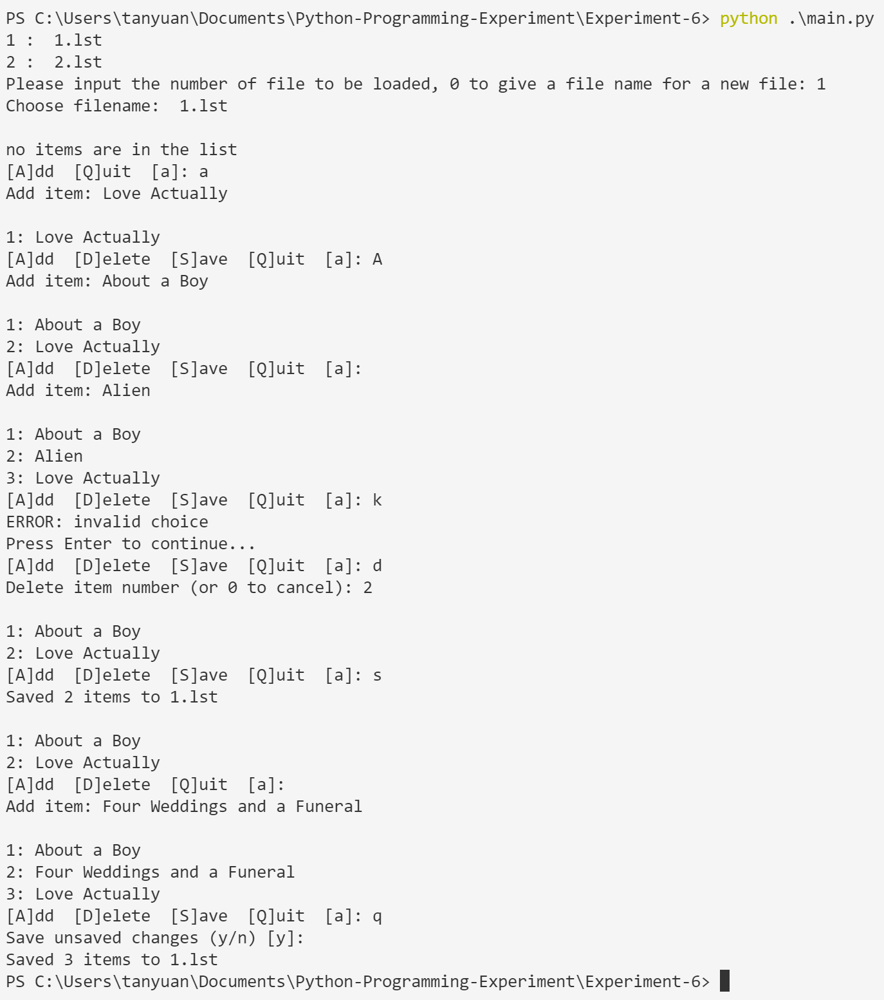
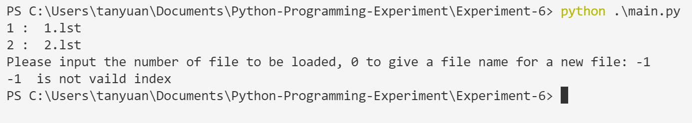
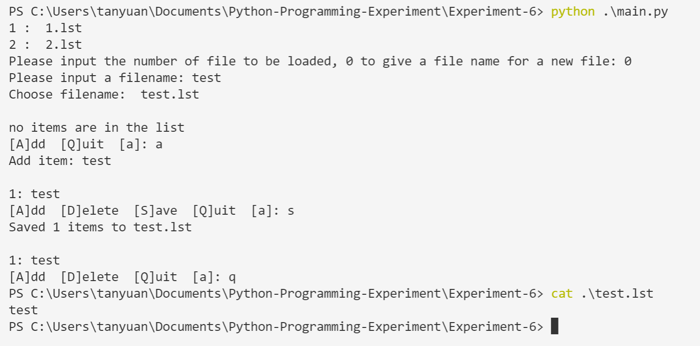

# Experiment 6

## 要求

## 思路

经过多次重构后，实现了题目要求的所有功能，并进行了异常处理。

迭代过程可见 [Commits · Reset12138/Python-Programming-Experiment (github.com)](https://github.com/Reset12138/Python-Programming-Experiment/commits/master)

对选项列表进行了动态处理，根据当前数据项情况动态显示、处理可用选项。

此外，注意到了这个问题，[python - Why does "return list.sort()" return None, not the list? - Stack Overflow](https://stackoverflow.com/questions/7301110/why-does-return-list-sort-return-none-not-the-list)

## 输入示例

- 

- 

- 

  
