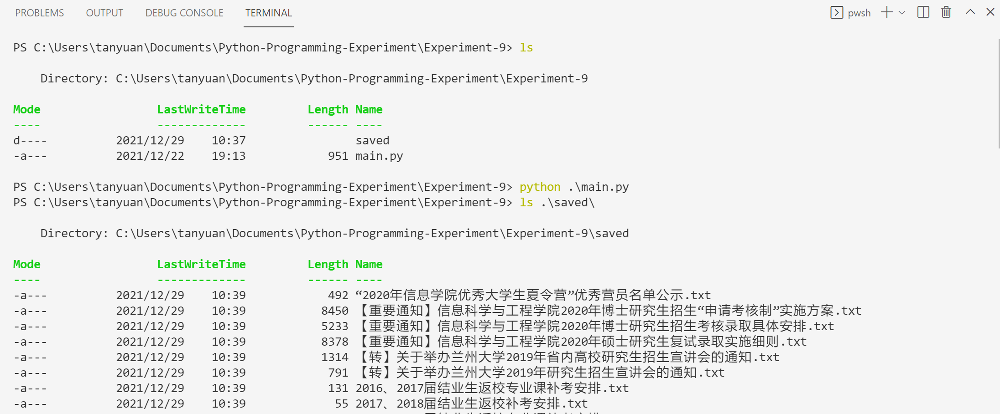
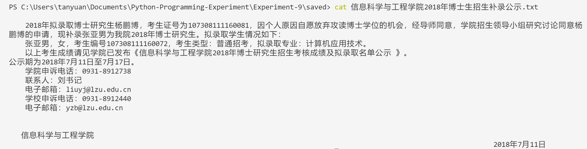

# Experiment 9

爬取兰州大学信息院的[通知公告](http://xxxy.lzu.edu.cn/tongzhigonggao/index.html)。

首先从浏览器开发者工具中得到[包含所有新闻的list](http://xxxy.lzu.edu.cn/xxxynew/lm/102325.js)。然后遍历。





```python
import requests
from bs4 import BeautifulSoup
import re
import os


def getList(url):
    r = requests.get(url)
    return r.json()
    # for i in json_data:
    #     print(i["articleTitle"])


def getContent(url):
    r = requests.get(url)
    r.encoding = "utf-8"
    # print(r.text)
    soup = BeautifulSoup(r.text, "html.parser")
    # print(soup.prettify())
    return soup.find(id="news").get_text()


# save data to file
def saveData(i):

    filename = "./saved/" + re.sub('[\/:*?"<>|]', " ", i["articleTitle"]) + ".txt"
    with open(filename, "w", encoding="utf-8") as f:
        f.write(i["content"])


url = "http://xxxy.lzu.edu.cn/xxxynew/lm/102325.js"
list = getList(url)

for i in list:
    if i["aurl"].startswith("/tongzhigonggao"):
        i["content"] = getContent("http://xxxy.lzu.edu.cn" + i["aurl"])


if not os.path.exists("./saved/"):
    os.makedirs("./saved/")
for i in list:
    if "content" in i:
        saveData(i)

```

